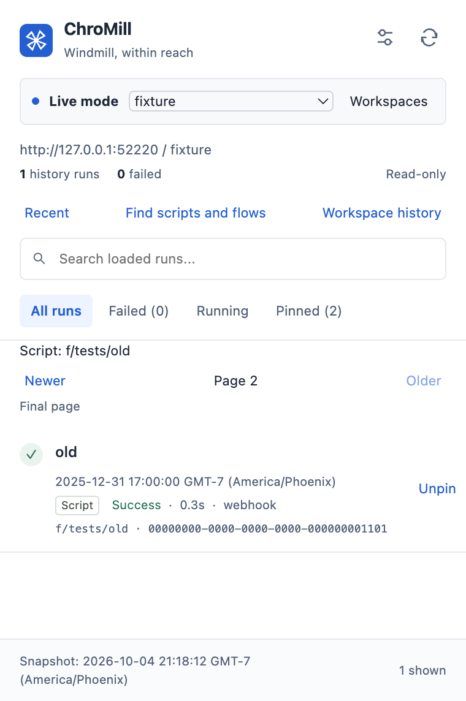

# ChroMill

Windmill runs, within reach in Chrome.

ChroMill is a Chrome extension for Windmill. Search scripts and flows by name. Browse recent runs and older history. Read results, logs, and inputs without leaving your browser tab.



The image uses synthetic test data.

## What it does

- Search scripts and flows by name, summary, or path.
- Use Script and Flow labels to tell them apart.
- Browse older runs with Older and Newer buttons.
- Pin runs so you can find them again.
- Read full results and logs in the Chrome side panel.
- Compare a failed run with an earlier successful run.
- Monitor the connected workspace while the popup is closed.

ChroMill only reads Windmill data. It does not start, retry, cancel, or edit jobs.

## Install from source

You need Chrome 127 or newer and [mise](https://mise.jdx.dev/). Mise installs the tool versions that this project uses.

1. Clone this repository.
2. Open a terminal in the repository folder.
3. Install the tools and dependencies.

```sh
mise install
mise run install
mise run build
```

4. Open `chrome://extensions` in Chrome.
5. Turn on Developer mode.
6. Select Load unpacked.
7. Select the `build/chrome-mv3-prod` folder.
8. Pin ChroMill to the Chrome toolbar.

ChroMill is not yet in the Chrome Web Store. Build it from source to use this version.

## Connect to Windmill

1. Open ChroMill from the toolbar.
2. Select the configuration button in the header.
3. Enter your Windmill base URL and API key.
4. Choose a ChroMill password with at least 12 characters.
5. Enter the same password in the confirmation field.
6. Select Save credentials.
7. Approve access to your Windmill site when Chrome asks.
8. Select Load workspaces.
9. Select your workspace.
10. Select Connect.

Your ChroMill password is separate from your Windmill password. Use a key with the read permissions that you need.

The API key stays encrypted in local storage. ChroMill uses AES-256-GCM and a password-based key with PBKDF2-SHA-256 at 600,000 iterations. Each save uses new random values.

> [!NOTE]
> Keep ChroMill unlocked to monitor runs. Lock pauses requests and monitoring. Closing the popup does not lock ChroMill.

There is no timed lock. Chrome closure, extension reload, extension updates, Lock, and Disconnect clear the unlock state. The saved connection stays encrypted.

To unlock, enter your password once in Enter password to unlock. Select Unlock. The saved fields then show `*******`. Those marks show saved state. They do not contain your password or key.

If you forget the password, remove the saved connection. Enter the API key again with a new password.

## Search and monitoring

Select Find scripts and flows. Enter part of a name, summary, or path. Select a result to open its history. Script and Flow results with the same path stay separate.

ChroMill searches up to 2,000 catalog rows for each type. Permissions and stored history limit the results. ChroMill shows a message when it cannot search the full catalog.

Monitoring reads the latest 100 runs once per minute. It does not prove that every run was observed. GAP means that monitoring coverage has a gap. The current warning stays after a gap occurs. Active runs in the side panel refresh every two seconds.

## Optional local helper

The normal connection works through Chrome on macOS, Windows, and Linux. It does not require the local helper.

The optional helper reads a host credential file or a 1Password named pipe. A named pipe passes data without a stored file. The current installer defaults to the macOS Chrome folder. Other systems need their Chrome native messaging folder.

Use the helper only if you need that route. It reads `WMILL_URL` and `WMILL_API_KEY` on the host. Never put these values in the extension bundle. See `native/install.py --help` for registration arguments.

## Develop and test

Use these commands from the repository folder.

```sh
mise run dev
mise run test
mise run native-test
mise run helper-test
mise run workflow-test
mise run lint
mise run typecheck
mise run build
```

The application tests do not load environment files. Browser tests use local synthetic data. Install the test browser before the browser journey.

```sh
mise run browser-install
mise run history-browser-test
```

Browser tests open the built Chrome extension. If Chrome requests access to the local test site, select Allow.

## Repository files

This public repository includes the Claude and Codex instructions and skills. It excludes local evidence, Backlog records, environment files, and credentials. Its initial commit starts from a clean source copy. Earlier development history is not public.

Local planning and live test tasks need tools or records that are not in this repository. The build and the test commands above work from the public source.

## License

ChroMill uses the [MIT license](LICENSE). ChroMill is an independent project. It is not an official Windmill or Google product.
